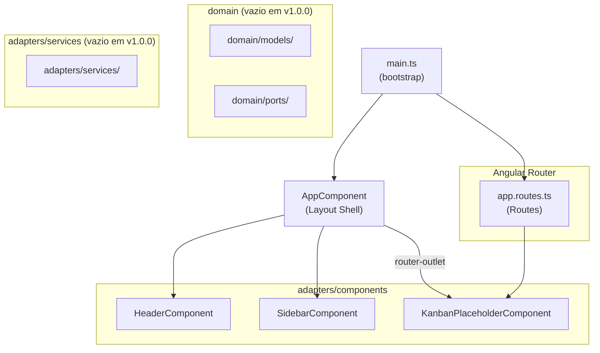
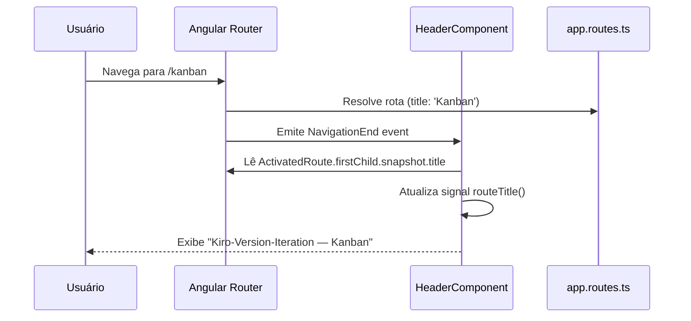

# Design Document — Kiro Kanban v1.0.0

## Overview

A iteração v1.0.0 estabelece o esqueleto funcional do SPA **Kiro-Version-Iteration**: um projeto Angular 21+ com Standalone Components, Angular Material e Arquitetura Hexagonal. O entregável é uma aplicação que compila sem erros, exibe o layout principal (Header + Sidebar + área de conteúdo) e roteia `/` e qualquer rota desconhecida para `/kanban`, onde um componente placeholder é renderizado.

Nenhuma lógica de negócio é implementada nesta iteração. O foco é a fundação estrutural sobre a qual as iterações seguintes (v2.0.0+) construirão o quadro Kanban completo.

---

## Estrutura de Arquivos e Diretórios

```
kiro-kanban/                          ← raiz do projeto Angular (ng new)
├── src/
│   ├── app/
│   │   ├── domain/                   ← camada interna (Hexagonal)
│   │   │   ├── models/               ← interfaces e tipos de domínio (vazio em v1.0.0)
│   │   │   └── ports/                ← interfaces de porta (vazio em v1.0.0)
│   │   │
│   │   ├── adapters/                 ← camada externa (Hexagonal)
│   │   │   ├── services/             ← implementações concretas (vazio em v1.0.0)
│   │   │   └── components/
│   │   │       ├── header/
│   │   │       │   ├── header.component.ts
│   │   │       │   └── header.component.scss
│   │   │       ├── sidebar/
│   │   │       │   ├── sidebar.component.ts
│   │   │       │   └── sidebar.component.scss
│   │   │       └── kanban-placeholder/
│   │   │           ├── kanban-placeholder.component.ts
│   │   │           └── kanban-placeholder.component.scss
│   │   │
│   │   ├── app.component.ts          ← Layout Shell (standalone)
│   │   ├── app.component.scss        ← estilos do layout shell
│   │   └── app.routes.ts             ← definição de rotas
│   │
│   ├── styles.scss                   ← tema Angular Material + resets globais
│   └── main.ts                       ← bootstrap da aplicação
│
├── angular.json
├── tsconfig.json
└── package.json
```

### Diretórios da Arquitetura Hexagonal (v1.0.0)

Os diretórios abaixo devem existir no sistema de arquivos ao final da iteração, mesmo que sem arquivos de lógica de negócio:

| Diretório | Propósito | Conteúdo em v1.0.0 |
|---|---|---|
| `src/app/domain/` | Camada de domínio | Vazio (estrutura criada) |
| `src/app/domain/models/` | Interfaces e tipos | Vazio |
| `src/app/domain/ports/` | Interfaces de porta | Vazio |
| `src/app/adapters/` | Camada de adaptadores | Componentes e serviços |
| `src/app/adapters/components/` | Componentes UI | `header/`, `sidebar/`, `kanban-placeholder/` |
| `src/app/adapters/services/` | Serviços concretos | Vazio |

> **Nota**: Para que o Git rastreie diretórios vazios, adicionar um arquivo `.gitkeep` em cada um.

---

## Componentes

### AppComponent (Layout Shell)

**Arquivo**: `src/app/app.component.ts`

**Responsabilidade**: Componente raiz que compõe o layout principal da aplicação. Não possui lógica de negócio — apenas estrutura o template com Header, Sidebar e `router-outlet`.

```typescript
@Component({
  selector: 'app-root',
  standalone: true,
  imports: [
    RouterOutlet,
    MatSidenavModule,
    MatToolbarModule,
    HeaderComponent,
    SidebarComponent,
  ],
  templateUrl: './app.component.html',
  styleUrl: './app.component.scss',
})
export class AppComponent {}
```

**Template** (`app.component.html`):
```html
<div class="app-shell">
  <app-header />
  <div class="app-body">
    <app-sidebar />
    <main class="app-content">
      <router-outlet />
    </main>
  </div>
</div>
```

**Inputs/Outputs**: Nenhum.

---

### HeaderComponent

**Arquivo**: `src/app/adapters/components/header/header.component.ts`

**Responsabilidade**: Exibe o nome da aplicação (`Kiro-Version-Iteration`) e o título da rota ativa na mesma linha, usando `mat-toolbar`.

```typescript
@Component({
  selector: 'app-header',
  standalone: true,
  imports: [MatToolbarModule],
  templateUrl: './header.component.html',
  styleUrl: './header.component.scss',
})
export class HeaderComponent {
  readonly appName = 'Kiro-Version-Iteration';
  readonly routeTitle = toSignal(
    inject(Router).events.pipe(
      filter(e => e instanceof NavigationEnd),
      map(() => inject(ActivatedRoute).firstChild?.snapshot.title ?? '')
    ),
    { initialValue: '' }
  );
}
```

**Template** (`header.component.html`):
```html
<mat-toolbar color="primary">
  <span class="app-name">{{ appName }}</span>
  <span class="route-separator" *ngIf="routeTitle()"> — </span>
  <span class="route-title">{{ routeTitle() }}</span>
</mat-toolbar>
```

**Inputs/Outputs**: Nenhum. O título da rota é obtido via `Router.events` + `ActivatedRoute.snapshot.title`.

> **Decisão de design**: O título da rota é lido diretamente do `title` definido em `app.routes.ts` (propriedade `title` da rota), evitando acoplamento entre Header e componentes filhos.

---

### SidebarComponent

**Arquivo**: `src/app/adapters/components/sidebar/sidebar.component.ts`

**Responsabilidade**: Renderiza a navegação lateral com `mat-nav-list`. Exibe links de navegação e aplica a classe `active` ao link da rota ativa via `routerLinkActive`.

```typescript
@Component({
  selector: 'app-sidebar',
  standalone: true,
  imports: [
    MatListModule,
    RouterLink,
    RouterLinkActive,
  ],
  templateUrl: './sidebar.component.html',
  styleUrl: './sidebar.component.scss',
})
export class SidebarComponent {
  readonly navItems: NavItem[] = [
    { label: 'Kanban', route: '/kanban' },
  ];
}

interface NavItem {
  label: string;
  route: string;
}
```

**Template** (`sidebar.component.html`):
```html
<mat-nav-list>
  @for (item of navItems; track item.route) {
    <a
      mat-list-item
      [routerLink]="item.route"
      routerLinkActive="active"
      [routerLinkActiveOptions]="{ exact: false }"
    >
      {{ item.label }}
    </a>
  }
</mat-nav-list>
```

**Inputs/Outputs**: Nenhum. A lista de itens de navegação é definida internamente como array estático.

---

### KanbanPlaceholderComponent

**Arquivo**: `src/app/adapters/components/kanban-placeholder/kanban-placeholder.component.ts`

**Responsabilidade**: Componente temporário que ocupa a rota `/kanban` na v1.0.0. Sem lógica de negócio — apenas exibe um texto indicativo de que o quadro Kanban será implementado nas próximas iterações.

```typescript
@Component({
  selector: 'app-kanban-placeholder',
  standalone: true,
  imports: [],
  templateUrl: './kanban-placeholder.component.html',
  styleUrl: './kanban-placeholder.component.scss',
})
export class KanbanPlaceholderComponent {}
```

**Template** (`kanban-placeholder.component.html`):
```html
<div class="kanban-placeholder">
  <h2>Kanban Board</h2>
  <p>Quadro Kanban será implementado na v2.0.0.</p>
</div>
```

**Inputs/Outputs**: Nenhum.

---

## Configuração de Rotas

**Arquivo**: `src/app/app.routes.ts`

```typescript
import { Routes } from '@angular/router';
import { KanbanPlaceholderComponent } from './adapters/components/kanban-placeholder/kanban-placeholder.component';

export const routes: Routes = [
  {
    path: '',
    redirectTo: 'kanban',
    pathMatch: 'full',
  },
  {
    path: 'kanban',
    component: KanbanPlaceholderComponent,
    title: 'Kanban',
  },
  {
    path: '**',
    redirectTo: 'kanban',
  },
];
```

### Decisões de Roteamento

| Rota | Comportamento | Justificativa |
|---|---|---|
| `/` | Redireciona para `/kanban` | `pathMatch: 'full'` garante que apenas a raiz exata redireciona |
| `/kanban` | Renderiza `KanbanPlaceholderComponent` | Rota principal da v1.0.0 |
| `/**` | Redireciona para `/kanban` | Wildcard captura qualquer rota inexistente |
| `title: 'Kanban'` | Título lido pelo `HeaderComponent` | Evita acoplamento entre Header e componentes de rota |

**Strategy**: `PathLocationStrategy` (padrão do Angular Router — sem `#` na URL). Configurado via `provideRouter(routes)` em `main.ts`.

---

## Layout CSS/SCSS

### AppComponent Shell Layout

**Arquivo**: `src/app/app.component.scss`

```scss
.app-shell {
  display: flex;
  flex-direction: column;
  height: 100vh;
  overflow: hidden;
}

.app-body {
  display: flex;
  flex: 1;
  overflow: hidden;
}

.app-content {
  flex: 1;
  overflow-y: auto;
  padding: 24px;
}
```

**Estratégia de layout**: Flexbox em dois níveis:
1. `.app-shell` — coluna vertical: Header (altura fixa) + `.app-body` (flex: 1)
2. `.app-body` — linha horizontal: Sidebar (largura fixa) + `.app-content` (flex: 1)

### SidebarComponent Layout

**Arquivo**: `src/app/adapters/components/sidebar/sidebar.component.scss`

```scss
:host {
  display: flex;
  flex-direction: column;
  width: 220px;
  min-height: 100%;
  background-color: var(--mat-sidenav-container-background-color, #fafafa);
  border-right: 1px solid rgba(0, 0, 0, 0.12);
}

mat-nav-list {
  padding-top: 8px;
}

a.active {
  background-color: rgba(var(--mat-primary-rgb, 63, 81, 181), 0.12);
  font-weight: 600;
}
```

### HeaderComponent Layout

**Arquivo**: `src/app/adapters/components/header/header.component.scss`

```scss
mat-toolbar {
  gap: 8px;
}

.app-name {
  font-weight: 700;
}

.route-separator,
.route-title {
  font-weight: 400;
  opacity: 0.85;
}
```

---

## Configuração do Angular Material

**Arquivo**: `src/styles.scss`

```scss
// 1. Importação do tema Angular Material
@use '@angular/material' as mat;

// 2. Inclusão dos estilos base do Material
@include mat.core();

// 3. Definição do tema customizado
$kiro-primary: mat.define-palette(mat.$indigo-palette);
$kiro-accent:  mat.define-palette(mat.$pink-palette, A200, A100, A400);
$kiro-warn:    mat.define-palette(mat.$red-palette);

$kiro-theme: mat.define-light-theme((
  color: (
    primary: $kiro-primary,
    accent:  $kiro-accent,
    warn:    $kiro-warn,
  ),
  typography: mat.define-typography-config(),
  density: 0,
));

// 4. Aplicação do tema
@include mat.all-component-themes($kiro-theme);

// 5. Resets globais
*,
*::before,
*::after {
  box-sizing: border-box;
}

html,
body {
  margin: 0;
  padding: 0;
  height: 100%;
  font-family: Roboto, 'Helvetica Neue', sans-serif;
}
```

### Bootstrap (`main.ts`)

```typescript
import { bootstrapApplication } from '@angular/platform-browser';
import { provideRouter } from '@angular/router';
import { provideAnimationsAsync } from '@angular/platform-browser/animations/async';
import { AppComponent } from './app/app.component';
import { routes } from './app/app.routes';

bootstrapApplication(AppComponent, {
  providers: [
    provideRouter(routes),
    provideAnimationsAsync(),
  ],
}).catch(err => console.error(err));
```

---

## Diagrama de Dependências entre Componentes



### Fluxo de Dados do Título da Rota



---

## Decisões Técnicas

| Decisão | Escolha | Justificativa |
|---|---|---|
| Título da rota no Header | `route.title` via `Router.events` | Desacopla Header dos componentes de rota; cada rota declara seu próprio título |
| Layout do shell | Flexbox (sem `mat-sidenav`) | `mat-sidenav` adiciona complexidade desnecessária para v1.0.0; Flexbox é suficiente e mais simples |
| Sidebar largura | Fixa em `220px` | Largura adequada para `mat-nav-list` com labels curtos; ajustável em iterações futuras |
| Diretórios vazios | `.gitkeep` | Garante que a estrutura Hexagonal seja rastreada pelo Git desde v1.0.0 |
| `provideAnimationsAsync` | Assíncrono | Recomendação do Angular 17+ para melhor performance de carregamento inicial |
| `pathMatch: 'full'` na raiz | Obrigatório | Sem `full`, o redirect `/` → `/kanban` capturaria todas as rotas |

---

## Correctness Properties

*Uma propriedade é uma característica ou comportamento que deve ser verdadeiro em todas as execuções válidas do sistema — uma declaração formal sobre o que o sistema deve fazer.*

### Property 1: Layout Shell sempre renderiza os três elementos

*Para qualquer* inicialização da aplicação, o DOM deve conter simultaneamente os elementos `app-header`, `app-sidebar` e `router-outlet`, todos visíveis na viewport.

**Validates: Requirements 1.1, 1.2**

### Property 2: Redirecionamento de rotas para /kanban

*Para qualquer* URL acessada que não seja `/kanban` (incluindo `/` e rotas inexistentes), a URL exibida no navegador após o carregamento deve ser `/kanban`.

**Validates: Requirements 2.2, 2.3**

### Property 3: Classe `active` exclusiva ao link da rota ativa

*Para qualquer* estado de navegação, exatamente o link correspondente à rota ativa deve possuir a classe CSS `active`, e todos os demais links da Sidebar não devem possuir essa classe.

**Validates: Requirements 3.3**

### Property 4: Título da rota exibido no Header

*Para qualquer* rota ativa com `title` definido em `app.routes.ts`, o `HeaderComponent` deve exibir esse título na mesma linha que o nome da aplicação `Kiro-Version-Iteration`.

**Validates: Requirements 2.4**

### Property 5: Ausência de estilos inline

*Para qualquer* componente da aplicação, nenhum elemento do template deve conter atributos `style` inline — toda estilização deve ser feita via arquivos `.scss`.

**Validates: Requirements 1.5, 4.5**
